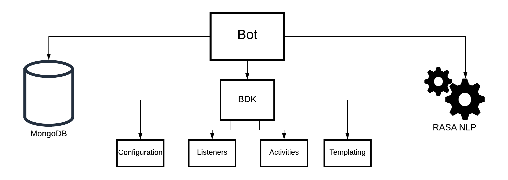

# NLP Webinar Bot

### This bot leverages Rasa NLP to create an interactive Symphony chatbot. 

## Symphony Bot Requirements
* JDK 8+
* [Symphony Java BDK](https://github.com/finos/symphony-bdk-java)
* Maven 3
* MongoDB 
* [Rasa NLP](https://rasa.com/docs/rasa/)

## Rasa Requirments
* Python 3.6, 3.7, or 3.8 
* pip3 

## Building a Bot with the Java BDK (Bot Developer Kit)



Building a Symphony Bot and integrating with other technologies such as MongoDB and RASA NLP is made easy with the Java BDK.

The functionality of this Symphony Bot comprised of 4 simple componenets: Configuration, Listeners, Activities, and Templating.

### 1. Symphony Bot Configuration

```
bdk:
  host: develop2.symphony.com
  bot:
    username: nlp-bdk-bot
    privateKey:
      path: rsa/privatekey.pem

rasa-action-server: http://localhost:5005/model/parse

logging:
  level:
    com.symphony: debug
```

### 2. Listeners
Bot event listeners are in many cases the entry point for your Bot Application.  To create a listener, you can annotate a function with the convenient Spring Boot @EventListener annotation:

```
@EventListener
public void onMessageSent(RealTimeEvent<V4MessageSent> event) {
    V4Message message = event.getSource().getMessage();
    String messageText = null;
    try {
        messageText = PresentationMLParser.getTextContent(message.getMessage());
    } catch (PresentationMLParserException ignored) {}
```   
The above function will capture all incoming messages where you can funnel them into your bot's custom business logic. 

### 3.  Activities
The majority of the bot's custom business logic will exist inside of Activities or building blocks for a workflow.  There are currently two types of activities, CommandActivities (activities that are triggered when messages are sent) and FormReplyAcitvities (activities that are triggered when a user submits an elements form). 
 
When creating activites, you must define a matching criteria, and a trigger that gets executed when there is a match:

```
@Component
@RequiredArgsConstructor
public class FetchTradesActivity extends FormReplyActivity<FormReplyContext> {
    private final MessageService messages;
    private final TradeService tradeService;
    private final List<String> tradeStates = Arrays.stream(TradeState.values())
        .map(TradeState::name).collect(Collectors.toList());

    @Override
    protected ActivityMatcher<FormReplyContext> matcher() {
        return context -> tradeStates.contains(context.getFormId())
            && "submit".equals(context.getFormValue("action"));
    }

    @Override
    protected void onActivity(FormReplyContext context) {
        String state = context.getFormId();
        log.debug("looking for {} trades", state);

        String counterparty = context.getFormValue("counterparty");
        String streamId = context.getSourceEvent().getStream().getStreamId();

        messages.send(streamId, "Fetching Trades that match this criteria...");
        List<Trade> trades = tradeService.getTrades(counterparty, TradeState.valueOf(state));

        if (trades.isEmpty()) {
            messages.send(streamId, "No " + state + " trades for this counterparty");
            return;
        }

        String message = messages.templates()
            .newTemplateFromClasspath("/templates/trade_table.ftl")
            .process(Map.of("trades", trades));
        messages.send(streamId, message);
    }
```    

### 4.  Templating

Lastly, our Bot leverages message templating in order to dynamically present trade data returned from MongoDB to users:

Build the template:
```
String message = messages.templates()
            .newTemplateFromClasspath("/templates/trade_table.ftl")
            .process(Map.of("trades", trades));
        messages.send(streamId, message);
```

Build your MessageML form and easily inject data dynamically:
```
<form id="trade-table">
    <h2>Select team members to help resolve trade breaks:</h2>
    <person-selector name="person-selector" required="true" placeholder="Required" />
    <table>
        <thead>
        <tr>
            <td>Counterparty</td>
            <td>Status</td>
            <td>State</td>
            <td>Description</td>
            <td>Portfolio</td>
            <td>Price</td>
            <td>Quantity</td>
            <td>Select</td>
        </tr>
        </thead>
        <tbody>
            <#list trades as trade>
                <tr>
                    <td>${trade.counterparty}</td>
                    <td>${trade.status}</td>
                    <td>${trade.state}</td>
                    <td>${trade.description}</td>
                    <td>${trade.portfolio}</td>
                    <td>${trade.price}</td>
                    <td>${trade.quantity}</td>
                    <td>${trade.transaction}</td>
                    <td>
                        <button name="resolve-${trade.id}" type="action">
                            RESOLVE
                        </button>
                    </td>
                </tr>
            </#list>
        </tbody>
    </table>
</form>

```

## Getting Started with NLP

For our Symphony Bot, we are leveraging Rasa NLP as our NLP engine.  We chose to use Rasa NLP because it is open source and able to be trained/run locally.  The business logic of this bot application is decoupled from the NLP engine so that one could replace Rasa with an NLP engine of choice.

### Rasa Quick Installation:
```
// create and activate your virtual environment
$ python3 -m venv env
$ source env/bin/activate

// install rasa: 
(env) $ pip3 install -U pip
(env) $ pip3 install rasa
```
After you have installed Rasa NLP, generate a new project scaffold:
```
(env) $ rasa init
```
Since our bot's business logic is decoupled from the NLP service, we will be using Rasa primarily as a NLU service.  To do so we will perform the following: 

1.  Train our models
2.  Test our models
3.  Run our NLU server
4.  Forward Symphony messages to NLU server for processing/predictions/parsing

## Training NLU-only models
To train an NLU model, run inside your newly generated nlp project: 
```
(env) $ rasa train nlu
```
This will look for NLU training data files in the data/ directory and saves a trained model in the models/ directory. The name of the model will start with nlu-.

## Testing your NLU model on the command line
To try out your NLU model on the command line, run the following command:
```
(env) $ rasa shell nlu
```
This will start the rasa shell and ask you to type in a message to test. You can keep typing in as many messages as you like.

Alternatively, you can leave out the nlu argument and pass in an nlu-only model directly:
```
(env) $ rasa shell -m models/nlu-20190515-144445.tar.gz
```

## Running an NLU server
To start a server with your NLU model, pass in the model name at runtime:
```
(env) $ rasa run --enable-api -m models/nlu-20190515-144445.tar.gz
```
You can then request predictions from your model using the /model/parse endpoint. To do this, run:

```
curl localhost:5005/model/parse -d '{"text":"hello"}'
```

## Updating your NLU Data
For this example, our bot will be focused primarily on post-trade reconcilliation.  To make sure our bot understands these types of requests, we need to make sure that our bot understands intents and entities that are relevant to this domain.  To do so define an intent and add some sample data in you ```data/nlu.yml``` file:

```
nlu:

- intent: request_trade_status
  examples: |
    - Can you show me the trades?
    - Are there any open trades
    - Let's see trades
    - Show me trades
    - Trades?
    - Can I see the trades?
    - Are there any [unresolved](trade_state) trades?
    - Show me the [unresolved](trade_state) trades?
    - Can I see the [unresolved](trade_state) trades please?
    - [unresolved](trade_state) trades?

```

Now our training Rasa model will return an intent=request_trade_status for any of the above messages or ones that are simiar.  The more training data you provide your Rasa NLU server, the more accurate it will be at classifying a message's intent.  

In addition notice the syntax of ```[keyword](entity)``` to properly flag entities within a given messages.  This is an easy way to train your NLU server to extract relevant data from input messages.  

For more information on how to extract entities from a given message continue [here](https://rasa.com/docs/rasa/training-data-format#entities).  Leveraging this functionality is was enables our bot to understand the nature of a given request, thus funneling a user to the correct pathway and returning the appropriate data.
